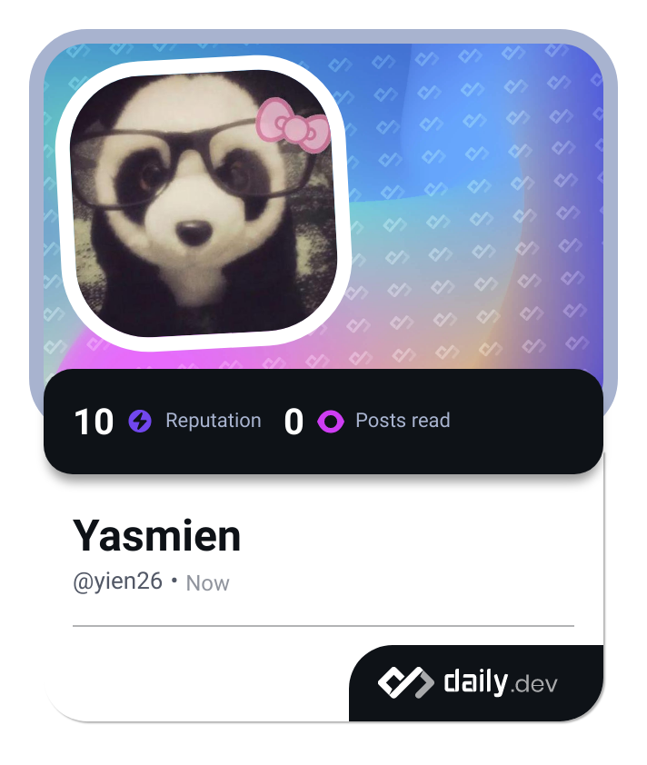

<a name="readme-top">

<br/>

<br />
<div align="center">
  <a href="https://github.com/zyx-0314/">
  <!-- TODO: If you want to add logo or banner you can add it here -->
    
  </a>
<!-- TODO: Change Title to the name of the title of your Project -->
  <h3 align="center">Header and Footer Styles</h3>
</div>
<!-- TODO: Make a short description -->
<div align="center">
  A simple header and footer designs both static and animated using html and css.
</div>

<br />

<!-- TODO: Change the zyx-0314 into your github username  -->
<!-- TODO: Change the WD-Template-Project into the same name of your folder -->


---

<br />
<br />

<!-- TODO: If you want to add more layers for your readme -->
<details>
  <summary>Table of Contents</summary>
  <ol>
    <li>
      <a href="#overview">Overview</a>
      <ol>
        <li>
          <a href="#key-components">Key Components</a>
        </li>
        <li>
          <a href="#technology">Technology</a>
        </li>
      </ol>
    </li>
    <li>
      <a href="#rule,-practices-and-principles">Rules, Practices and Principles</a>
    </li>
    <li>
      <a href="#resources">Resources</a>
    </li>
  </ol>
</details>

---

## Overview

<!-- TODO: To be changed -->
<!-- The following are just sample -->
The project is a website consisting of two main pages. Each page has specific components: one page contains 10 headers, and the other page contains 10 footers. Five of these headers and footers are static (unchanging), while the other five are animated.

Guiding Question:
- The purpose of the website is to showcase a design concept where headers and footers are prominent features. Headers typically contain navigation links, titles, or branding elements at the top of a webpage. Footers, on the other hand, usually contain supplementary information, contact details, social media links, or other relevant content at the bottom of a webpage. The inclusion of animated footers adds a dynamic and engaging element to the user experience.

- What are key components
- Headers Page:
  - 10 distinct headers showcasing different styles or functionalities.
  - Each header may include navigation menus, logos, search bars, or other relevant content.
- Footers Page:
  - 10 footers divided into 5 static and 5 animated.
  - Static footers will display consistent information such as copyright notices, contact information, and links.
  - Animated footers will feature dynamic content that may include interactive elements or visual effects.
- What technology used and how it is used
HTML/CSS: Used for structuring the content (HTML) and styling it (CSS).


### Key Components
<!-- TODO: List of Key Components -->
<!-- The following are just sample -->
- MultiPage Website/Single Page Website
- Parallax transition
- Transactional

### Technology
<!-- TODO: List of Technology Used -->


## Rules, Practices and Principles
1. Always use `WD-` in the front of the Title of the Project for the Subject followed by your custom naming.
2. Do not rename any .html files; always use `index.html` as the filename.
3. Place Files in their respective folders.
4. All file naming are in camel case.
   - Camel case is naming format where there is no white space in separation of each words, the first word is in all lower case while the succeding words first letter are in upper followed by lower cased letters.
   - ex.: buttonAnimatedStyle.css
5. Use only `External CSS`.
6. Renaming of Pages folder names are a must, and relates to what it is doing or data it holding.
7. File Structure to follow below.

```
WD-ProjectName
└─ assets
|   └─ css
|   |   └─ style.css
|   └─ img
|   |   └─ fileWith.jpeg/.jpg/.webp/.png
|   └─ js
|       └─ script.js
└─ pages
|  └─ pageName
|     └─ assets
|     |  └─ css
|     |  |  └─ style.css
|     |  └─ img
|     |  |  └─ fileWith.jpeg/.jpg/.webp/.png
|     |  └─ js
|     |     └─ script.js
|     └─ index.html
└─ index.html
└─ readme.md
```

## Resources

<!-- TODO: Add References -->
| Title | Purpose | Link |
|-|-|-|
| Hover Effects | Used as reference to get hover effects | https://ianlunn.github.io/Hover/ |
